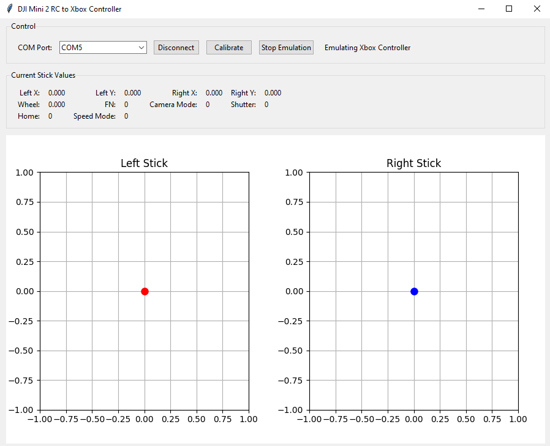

# DJI Mini 2 RC to Xbox Controller for windows

Преобразование пульта управления дрона DJI Mini 2 (RC‑N1, RCS231, WM161b‑RC‑N1) в игровой контроллер Xbox 360 для ПК.  
Программа предназначена для использования в FPV‑симуляторах (Liftoff, VelociDrone, DRL и др.) и любых играх, поддерживающих геймпад.

Turn the DJI Mini 2 remote controller (RC‑N1, RCS231, WM161b‑RC‑N1) into a virtual Xbox 360 gamepad. It is intended for use in FPV simulators (Liftoff, VelociDrone, DRL, etc.) and any game that supports a gamepad.

## Использование / How to use



**Основные элементы интерфейса / Main interface elements**

* **COM Port** – выбор последовательного порта, к которому подключён пульт.  
  Select the serial port connected to the remote controller.

* **Connect / Disconnect** – подключение/отключение от пульта.  
  Connect to or disconnect from the controller.

* **Calibrate** – запуск калибровки стиков и колёсика. Следуйте инструкциям на экране: двигайте каждый стик во все крайние положения и оставляйте в центре.  
  Launch stick and wheel calibration. Follow the on‑screen instructions: move each stick to all extremes and release to the center.

* **Start Emulation / Stop Emulation** – начало/остановка эмуляции Xbox‑контроллера.  
  Start or stop Xbox controller emulation.

* **Current Stick Values** – числовые значения всех осей и кнопок в реальном времени.  
  Real‑time numeric values of all axes and buttons.

* **Графики / Graphs** – визуальное отображение положения левого и правого стиков.  
  Visual representation of left and right stick positions.

**Соответствие кнопок пульта кнопкам Xbox / Button mapping**

| Элемент пульта               | Кнопка Xbox       |
|------------------------------|-------------------|
| Левый стик (X, Y)            | Левый стик        |
| Правый стик (X, Y)           | Правый стик       |
| Левое колёсико               | Правый триггер RT |
| Переключатель скоростей      | Левый триггер LT  |
| FN                           | A                 |
| Camera Mode                  | B                 |
| Shutter                      | X                 |
| Home                         | Y                 |

| RC element                   | Xbox button       |
|------------------------------|-------------------|
| Left stick (X, Y)            | Left stick        |
| Right stick (X, Y)           | Right stick       |
| Left wheel                   | Right trigger RT  |
| Speed switch                 | Left trigger LT   |
| FN                           | A                 |
| Camera Mode                  | B                 |
| Shutter                      | X                 |
| Home                         | Y                 |

*После запуска эмуляции проверьте работу контроллера в стандартной утилите Windows: `joy.cpl`.*  
*After starting emulation, test the virtual controller using the Windows built‑in tool: `joy.cpl`.*

## Системные требования и установка / System requirements & installation

**Требования / Requirements**
- Windows 7 / 8 / 10 / 11
- Python 3.7 или выше / Python 3.7 or higher
- Драйвер vJoy (виртуальный джойстик) – [скачать](https://sourceforge.net/projects/vjoystick/)  
  vJoy driver – [download](https://sourceforge.net/projects/vjoystick/)
- Драйвер ScpVBus (vXboxInterface) – [релиз](https://github.com/shauleiz/vXboxInterface/releases) (необходим для работы `pyxinput`)  
  ScpVBus driver – [release](https://github.com/shauleiz/vXboxInterface/releases) (required for `pyxinput`)
- Пульт DJI Mini 2, подключённый к ПК через USB (определяется как COM-порт)  
  DJI Mini 2 remote controller connected via USB (appears as a COM port)

## Подключение пульта / Connecting the remote controller

- Подключите пульт к ПК через USB-кабель в **задний порт** (порт для зарядки, расположенный на нижней части пульта, где находятся пазы для стиков).  
  *Connect the remote controller to your PC via USB cable into the **rear port** (the charging port located on the bottom of the controller, where the stick slots are).*
- Включите пульт (нажмите и удерживайте кнопку питания).  
  *Turn on the remote controller (press and hold the power button).*
- После подключения в Диспетчере устройств должен появиться COM-порт.  
  *After connection, a COM port should appear in Device Manager.*

**Установка / Installation**

1. Установите vJoy и ScpVBus, следуя инструкциям на их страницах (запуск от имени администратора, перезагрузка).  
   Install vJoy and ScpVBus following the instructions on their pages (run as administrator, reboot).

2. Убедитесь, что в Диспетчере устройств появились `vJoy Device` и `Scp Virtual Bus Driver`.  
   Verify that `vJoy Device` and `Scp Virtual Bus Driver` appear in Device Manager.

3. Скачайте или скопируйте файлы программы в отдельную папку:  
   Download or copy the program files into a separate folder:
   - `rc_to_xbox.py`
   - `requirements.txt`
   - `install_and_run.bat` (опционально / optional)

4. Установите необходимые библиотеки Python:  
   Install the required Python libraries:
   ```bash
   pip install -r requirements.txt
   ```

5. Запустите программу:  
   Run the program:
   ```bash
   python rc_to_xbox.py
   ```
   Или дважды кликните `install_and_run.bat` (запустит установку и сразу откроет программу).  
   Or double‑click `install_and_run.bat` (it will install dependencies and launch the program).
## Устранение возможных проблем / Troubleshooting

### Пульт не определяется / Controller not detected
- Убедитесь, что пульт включён и подключён к USB.  
  *Make sure the controller is powered on and connected via USB.*
- В Диспетчере устройств (Устройства и принтеры → Диспетчер устройств) должен отображаться COM-порт (обычно CH340 или CP210x).  
  *In Device Manager, a COM port (usually CH340 or CP210x) should appear.*
- Если порт отсутствует, установите драйвер для чипа USB‑to‑UART (например, CH340).  
  *If no COM port appears, install the appropriate USB‑to‑UART driver (e.g., for CH340).*

### Данные не считываются / No data received
- Закройте программу.  
  *Close the program.*
- Отключите пульт от USB.  
  *Disconnect the remote controller from USB.*
- Выключите пульт (если он был включён), подождите 5 секунд, затем включите его заново.  
  *Turn off the controller (if it was on), wait 5 seconds, then turn it on again.*
- Подключите пульт к USB, дождитесь появления COM-порта в Диспетчере устройств (5–10 секунд).  
  *Reconnect the controller to USB and wait for the COM port to appear in Device Manager (5–10 seconds).*
- Запустите программу и попробуйте подключиться снова.  
  *Launch the program and attempt to connect again.*

### Ошибка при запуске эмуляции: `MissingDependancyError` или `VIGEM_ERROR_BUS_NOT_FOUND`
Это означает, что не установлен или не активирован драйвер виртуального контроллера.  
*This indicates that the virtual controller driver is not installed or not activated.*

#### Установка vJoy
1. Скачайте установщик vJoy с [SourceForge](https://sourceforge.net/projects/vjoystick/).  
   *Download the vJoy installer from [SourceForge](https://sourceforge.net/projects/vjoystick/).*
2. Запустите `vJoySetup.exe` от имени администратора, завершите установку и перезагрузите компьютер.  
   *Run `vJoySetup.exe` as administrator, complete the installation, and reboot.*
3. Откройте **Configure vJoy** (в меню Пуск), установите галочку **Enable vJoy**, задайте количество осей (минимум 6) и кнопок (минимум 4), нажмите **Apply**.  
   *Open **Configure vJoy** (Start menu), check **Enable vJoy**, set at least 6 axes and 4 buttons, click **Apply**.*

#### Установка ScpVBus (vXboxInterface)
Если `pyxinput` выдаёт ошибку `MissingDependancyError`, необходимо установить драйвер ScpVBus.

**Способ 1: автоматическая установка (если есть `install.bat`)**
- Скачайте последний релиз vXboxInterface с [GitHub](https://github.com/shauleiz/vXboxInterface/releases).  
  *Download the latest vXboxInterface release from [GitHub](https://github.com/shauleiz/vXboxInterface/releases).*
- Распакуйте архив, найдите папку с `install_x64.bat` (или `install.bat`).  
  *Extract the archive and locate `install_x64.bat` (or `install.bat`).*
- Запустите этот файл **от имени администратора** (правый клик → «Запуск от имени администратора»).  
  *Run this file **as administrator** (right‑click → «Run as administrator»).*
- После успешной установки перезагрузите компьютер.  
  *Reboot after successful installation.*

**Способ 2: ручная установка через .inf файл (если install.bat не сработал)**
1. В распакованном архиве найдите файл `ScpVBus.inf` (обычно в подпапке `x64`).  
   *In the extracted archive, locate `ScpVBus.inf` (usually in the `x64` subfolder).*
2. Откройте **Диспетчер устройств** (правый клик по кнопке Пуск → Диспетчер устройств).  
   *Open **Device Manager** (right‑click Start → Device Manager).*
3. В верхнем меню выберите **Действие → Установить старое устройство**.  
   *In the top menu, select **Action → Add legacy hardware**.*
4. Нажмите «Далее», выберите **Установка оборудования, выбранного из списка вручную (Advanced)** → «Далее».  
   *Click «Next», choose **Install the hardware that I manually select from a list (Advanced)** → «Next».*
5. Выберите тип **Устройства, поддерживаемые производителем (Show All Devices)** → «Далее».  
   *Select **Show All Devices** → «Next».*
6. Нажмите **Установить с диска (Have Disk)** → «Обзор» и укажите путь к файлу `ScpVBus.inf`.  
   *Click **Have Disk** → «Browse» and point to the `ScpVBus.inf` file.*
7. Подтвердите установку, проигнорируйте предупреждение о безопасности драйвера (нажмите «Установить»).  
   *Confirm installation, ignore the driver security warning (click «Install»).*
8. После завершения перезагрузите компьютер.  
   *Reboot when finished.*

После установки обоих драйверов в Диспетчере устройств должны появиться:
- **vJoy Device** (в разделе «Устройства для работы с играми»)
- **Scp Virtual Bus Driver** (в разделе «Контроллеры USB» или «Системные устройства»)

*After installing both drivers, Device Manager should show:*
- *vJoy Device (under «Human Interface Devices» or «Game controllers»)*
- *Scp Virtual Bus Driver (under «USB controllers» or «System devices»)*

### Ошибка `Write timeout` при подключении / Write timeout on connection
- Убедитесь, что выбран правильный COM-порт.  
  *Ensure the correct COM port is selected.*
- Проверьте, что другие программы (DJI Assistant, терминалы) не используют тот же порт.  
  *Make sure no other program (DJI Assistant, terminal) is using the same port.*
- Отключите и снова подключите USB-кабель, перезапустите программу.  
  *Disconnect and reconnect the USB cable, restart the program.*

### Ошибка импорта `pyxinput` / `pyxinput` import error
- Убедитесь, что библиотека установлена: `pip install pyxinput`.  
  *Check that the library is installed: `pip install pyxinput`.*
- Если ошибка persists, возможно, не установлены драйверы (см. выше).  
  *If the error persists, the drivers may not be installed (see above).*

### Графики не обновляются / Graphs do not update
- Убедитесь, что вкладка с программой активна (в фоновом режиме обновление может замедляться).  
  *Make sure the program window is active (background updates may be slower).*
- Проверьте, что в консоли нет ошибок чтения с COM-порта.  
  *Check the console for serial read errors.*

Если ни один из способов не помог, создайте issue на GitHub с описанием проблемы и логами из консоли.  
*If none of the above helps, please open an issue on GitHub with a description of the problem and console logs.*

---

## Автор / Author

Created by Nill|981

## Благодарности / Acknowledgements

Проект вдохновлён идеей [usatenko/DjiMini2RCasJoystick](https://github.com/usatenko/DjiMini2RCasJoystick).  
*This project is inspired by the work of [usatenko/DjiMini2RCasJoystick](https://github.com/usatenko/DjiMini2RCasJoystick).*


